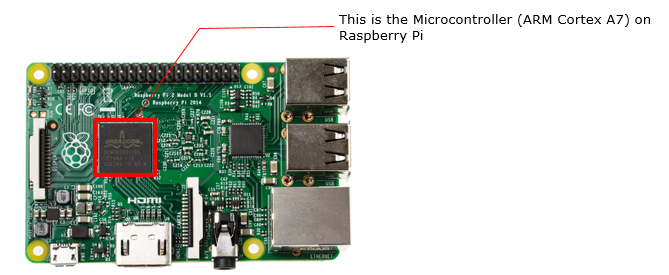
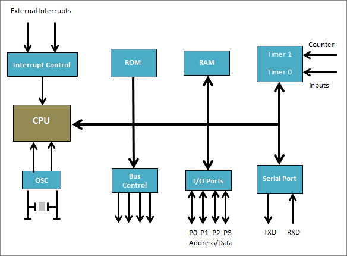
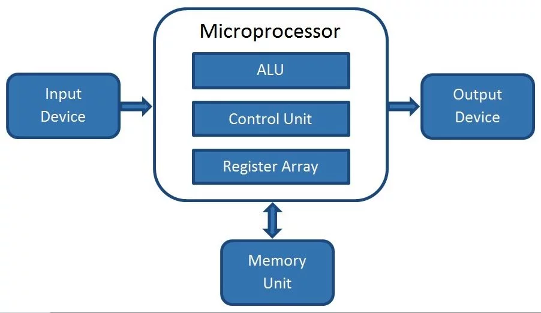
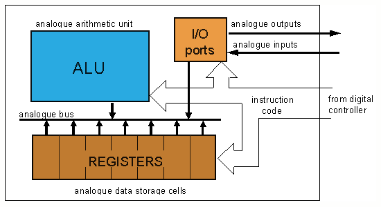

# Computer Architecture Lab 2019 

## Part 1: Differences between microcontroller and microprocessor

### Microcontroller
- Contains processor core, RAM, ROM, and I/O pins all on a single chip
- As it contains all the components need on a single chip, it does not require any external circuit to do its task
- made for specific task
- low cost as it is made by the complementary metal oxide semiconductor technology
- processing speed is about **8MHz to 50 MHz**

### Microprocessor
- has only a CPU inside them in one or few integrated circuit
- dependent on external circuit or peripheral to work
- made for general task (**complex task**)
- higher cost because of high number of external components require for such system
- processing speed is above **1GHz**
- power comsumption is high because of absence of power saving mode and also it connects to many external components

