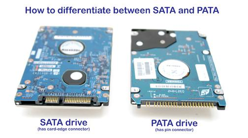

# Computer Architecture Lab 2019 

## Part 1: Differences between microcontroller and microprocessor

### Microcontroller
- Contains processor core, RAM, ROM, and I/O pins all on a single chip
- As it contains all the components need on a single chip, it does not require any external circuit to do its task
- made for specific task
- low cost as it is made by the complementary metal oxide semiconductor technology
- processing speed is about **8MHz to 50 MHz**

### Microprocessor
- has only a CPU inside them in one or few integrated circuit
- dependent on external circuit or peripheral to work
- made for general task (**complex task**)
- higher cost because of high number of external components require for such system
- processing speed is above **1GHz**
- power comsumption is high because of absence of power saving mode and also it connects to many external components

## Part 2: Myduino Board Anatomy

- Arduino Nano

  A rapid prototyping board that contains a microcontroller. Similar to a small computer, it can be programmed to control inputs and outputs peripheral devices.

- NodeMCU

  A development board with onboard WIFI to allow remote control and data logging over the Internet.

- Wireless radio

  Used for wireless communication for monitoring and remote control.

- Bluetooth communication

  Allows remote control and monitoring with android mobile devices.

- Variable resistor (Potentiometer)

  A potentiometer that can change resistance when rotated.

- Liquid crystal display

  To display sensor reading and text messages.

- Temperature and humidity sensor (DTH11)

  To measure surrounding temperature and humidity.

- Light sensor

  To measure the reading of ambient light.

- Real time clock (RTC)

  Used to store time even when power is not available because it has onboard coin cell battery backup.

- Switch (Push button)

  To allow Arduino to sense digital input to exwcute certain task.

- Light emmiting diode

  A diode that produces light commonly used for basic Arduino learning.

- Temperature sensor

  To measure surrounding temperature using analog sensor.

- Uno footprint prototyping area

  The Arduino Nano is connected to this UNO footprint. These connections allow prototyping of circuits and connection of shields.

- RGB LED

  A tri-color LED consists of red, green and blue light.
  
- Buzzer

  To generate alarm or tone audio to play melody.

## Part 3: Personal Computer Hardware Anatomy

### Processor
  - [Multicore Processing](https://insights.sei.cmu.edu/sei_blog/2017/08/multicore-processing.html)

### Bus

Connect components to the computer's processor. Internal bus carries the data within the motherboard while external bus carries the data to peripherals and other devices that attach to the motherboard. There are three types of bus called: Address bus, Data bus and Control bus. 

**Address Bus**
  - The component pass memory address to one another over the address bus.

**Data Bus**
  - Carry data and transferred between peripherals, memory and the CPU.

**Control Bus**
  - Used to send out the signal to coordinate and manage the activities of the motherboard components. 

**Frontside Bus, Backside Bus and PCI Cards**
  - The frontside bus is a physical connection that actually connects the processor to most of the other components in the computer, including main memory (RAM), hard drives and the PCI slots. The backside bus is a separate connection between the processor and the Level 2 cache. This bus operates at a faster speed than the frontside bus, usually at the same speed as the processor, so all that caching works as efficiently as possible.

### PCI
PCI is the acronym for Peripheral Component Interconnect, it is a local computer bus to attaching hardware devices in computer. It  allows you to insert expansion cards into your computer. These can come in the form of sound cards, RAID cards, SSDs, graphics cards, Coprocessors, and several other functional computer parts. 
  - [What is the difference between PCI and PCI Express](https://www.quora.com/What-is-the-difference-between-PCI-and-PCI-Express)
  - [Why is serial data transmission is faster than parallel?](https://superuser.com/questions/602819/why-is-serial-data-transmission-faster-than-parallel)

### GPU
A GPU is a specialized electronic circuit designed to rapidly manipulate and alter memory to accelerate the creation of images in a frame buffer intended for output to a display device. The GPU’s advanced capabilities were originally used primarily for 3D game rendering. But now those capabilities are being harnessed more broadly to accelerate computational workloads in areas such as financial modeling, cutting-edge scientific research and oil and gas exploration.

**GPU VS Graphic card?**
  - GPU is a chip where as graphics card is GPU + its circuit board + cooler. What a GPU does is it reduce load on CPU by processing the graphical content. Basically by adding a graphics card you are adding another processor dedicated for graphical purposes.

### Memory

**RAM**
  - Random-access memory is a form of computer data storage that stores data and machine code currently being used. A random-access memory device allows data items to be read or written in almost the same amount of time irrespective of the physical location of data inside the memory.

**DDR4**
  - [DDR4 Memory](https://www.lifewire.com/ddr4-memory-833028)

**Cache Memory**
  - [Difference between L1 cache and L2 cache](https://stackoverflow.com/questions/3699582/what-is-the-difference-between-l1-cache-and-l2-cache)
  - [How does a cache memory differ from registers?](https://www.quora.com/How-does-a-cache-memory-differ-from-registers)

**Hard Drive**
  - [SSD VS HDD](https://www.storagereview.com/ssd_vs_hdd)
  - [SSD vs. HDD: What's the Difference?](https://www.pcmag.com/article/297758/ssd-vs-hdd-whats-the-difference)

**Serial ATA**
  - Serial ATA is a computer bus interface that connects host bus adapters to mass storage devices such as hard disk drives, optical drives, and solid-state drives. Serial ATA succeeded the earlier Parallel ATA standard to become the predominant interface for storage devices. 

  - [SATA VS PATA](https://www.computerhope.com/issues/ch001325.htm)
  
  

  

## Part 4: Arduino

- [Download Arduino IDE](https://www.arduino.cc/en/main/software)
- Finding com port number
  - Go to **Device manager**
  - Navigate to **Ports(COM & LPT)**

  

- Setup Arduino IDE
  - Go to **Tools** menu and select correct **Board** and **Port**
  
- Pulse Width Modulation (PWM)
  - As microcontroller is purely digital, a technique called PWM could simulate the functions of an analog signal by having the capabilities of producing varying output, i.e. 2.3V or 3.8V.

  - PWM produces the varying analog values by changing the width of the digital pulse on time which is repeated at a very fast rate. The result is a steady voltage between 0 - 5V. 

  - There are dedicated digital pins on the Arduino that are capable of producing analog output through PWM. On the Nano and UNO, these pins are **3, 5, 6, 9, 10, 11**

  - The digital pulse on time in PWM is set by a value of between 0 to 255 representing an analog voltage output of 0 to 5V.

  - Example if Digital data = 128 Vout = 128 * 0.01956 = 2.5088V.

- As microcontrollers only work in digital, an **Analog to Digital Converter (ADC)** converts analog voltage signal to its corresponding digital values.

- The analog input signal having a range of 0-5V returns a number between 0 -1023 as its digital representation.
  - digital output = analog input / 0.0048
  - analog input = digital output * 0.0048

- Liquid Crystal Display (LCD)
  - [ASCII to Hex Converter](https://www.rapidtables.com/convert/number/ascii-to-hex.html)
